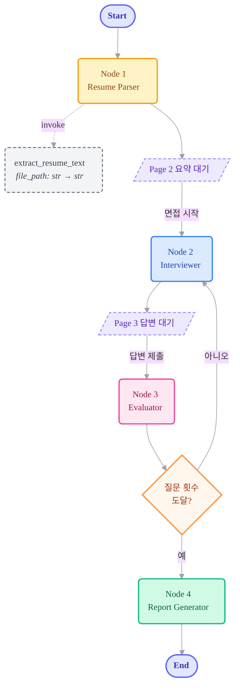

# 🤖 Backend — LangGraph Agent Architecture

본 폴더는 FastAPI + LangGraph 기반의 AI 에이전트 서버 코드입니다.

## 1. 기술 스택

| 영역 | 사용 기술 |
|------|---------|
| API Server | FastAPI + Uvicorn |
| Agent Framework | LangGraph (상태 머신/라우팅), LangChain |
| LLM | OpenAI `gpt-4o-mini` |
| PDF 파싱 | PyPDF2 |
| Package Manager | `uv` |

## 2. 시스템 아키텍처 (LangGraph Workflow)

Tech-Interviewer AI는 단순 단일 프롬프트 챗봇이 아니라 **상태 기반 워크플로우(State-based Workflow)** 입니다. 사용자(프론트엔드) 입력을 대기하기 위해 그래프 실행을 멈추고(Interrupt), 입력이 들어오면 평가와 다음 질문 생성을 반복합니다.



## 3. 상태 (InterviewState)

```python
from typing import TypedDict, List, Dict, Annotated
from langgraph.graph.message import add_messages

class InterviewState(TypedDict):
    resume_summary: Dict                      # 파서가 뽑은 이력서 요약 데이터
    messages: Annotated[list, add_messages]   # 오가는 채팅 기록
    question_count: int                       # 현재 진행된 질문 수
    max_questions: int                        # 최대 질문 수 (기본 5)
    evaluations: List[Dict]                   # 턴마다 누적되는 평가 결과 (점수, 피드백)
    final_report: Dict                        # 최종 결과 리포트
```

## 4. 노드 (Nodes)

| 노드 | 역할 | Interrupt |
|-----|------|-----------|
| **Node 1: Resume Parser** | PDF에서 raw text를 추출(아래 `extract_resume_text` tool 위임)한 뒤 LLM으로 기술 스택·프로젝트·핵심 역량을 JSON으로 구조화하여 `resume_summary`에 저장 | Page 2 전 대기 |
| **Node 2: Interviewer** | `resume_summary`와 이전 `messages`를 보고 다음 질문(또는 꼬리 질문) 생성, `question_count` +1 | Page 3 답변 대기 |
| **Node 3: Evaluator** | 사용자 답변을 평가하여 `evaluations`에 점수 + 피드백 누적 | - |
| **Node 4: Report Generator** | 누적된 `evaluations`를 바탕으로 최종 레이더 차트 데이터 + 종합 피드백 생성 | - |

### Tools (`backend/tools.py`)

LangChain `@tool` 데코레이터로 등록된 재사용 가능한 함수들. 노드 안에서 직접 호출하거나 향후 LLM이 자율적으로 invoke할 수 있도록 schema가 노출됩니다.

| 이름 | Input | Output | 용도 |
|-----|------|--------|------|
| `extract_resume_text` | `file_path: str` (로컬 PDF 경로) | `str` (모든 페이지의 raw text, 줄바꿈 구분) | Resume Parser 노드의 PDF 추출 단계. PyPDF2로 페이지 별 텍스트 추출 |

```python
# backend/tools.py
@tool
def extract_resume_text(file_path: str) -> str:
    """Read a resume PDF from the local filesystem and return its raw extracted text."""
    ...
```

호출 예시:
```python
from tools import extract_resume_text
text = extract_resume_text.invoke({"file_path": "/tmp/resume.pdf"})
```

## 5. 프롬프트 엔지니어링

### Interviewer Prompt
```text
당신은 10년 차 시니어 개발자이자 엄격하지만 합리적인 기술 면접관입니다.
지원자의 이력서 내용과 이전 답변을 기반으로 실무 역량을 검증해야 합니다.

[원칙]
1. 단순한 개념 질문보다는 경험 기반 질문을 하세요.
   ("React를 사용해 상태 관리를 하셨는데, 왜 Redux 대신 Zustand를 선택하셨나요?")
2. 한 번에 하나의 질문만 하세요.
```

### Evaluator Prompt
```text
지원자의 이전 답변을 평가하세요.

[입력 정보]
- 방금 한 질문: {current_question}
- 지원자의 답변: {user_answer}

[지시사항]
1. 지원자의 답변이 논리적이고 기술적으로 정확한가요? (1~10점)
2. 답변이 충분히 깊이가 있다면 긍정적으로 평가하고, 부족하다면 어떤 부분이 부족한지
   피드백을 남기세요. (이 피드백은 면접관이 다음 꼬리 질문을 만드는 데 사용됩니다.)
```

### Report Prompt
```text
지금까지의 면접 대화 기록과 평가(evaluations)를 바탕으로 지원자의 역량을 종합 평가하세요.

[출력 형식 (JSON)]
{
  "scores": {
    "cs_fundamentals": 80, "framework_usage": 90,
    "problem_solving": 75, "communication": 85
  },
  "feedback": {
    "strengths": "대용량 트래픽 처리 경험에 대한 구체적인 수치 제시가 훌륭합니다.",
    "weaknesses": "기술의 단점이나 한계에 대한 고려가 다소 부족합니다.",
    "improvements": [...]
  }
}
```

## 6. API 엔드포인트

| 메서드 | 경로 | 용도 |
|--------|-----|------|
| `POST` | `/api/upload` | PDF 업로드 → Resume Parser 실행 |
| `POST` | `/api/chat` | 사용자 답변 → Evaluator → Interviewer (또는 Report) |
| `GET` | `/` | 헬스체크 |

CORS: `localhost:5173`, `5174`, `3000` 만 허용.

## 7. 실행

```bash
cd backend
uv sync
uv run uvicorn main:app --reload --host 0.0.0.0 --port 8000
```

## 8. 환경 변수

`backend/.env` 또는 모노레포 루트 `.env` 에 다음을 정의:
```env
OPENAI_API_KEY="your-api-key-here"
```
