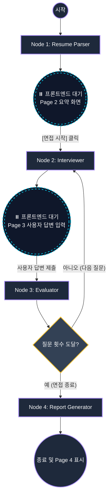

# 🤖 Backend AI Agent Architecture (LangGraph)

본 문서는 백엔드(FastAPI + LangGraph) 시스템의 핵심 설계와 기술 스펙을 정의합니다.

## 1. 기술 스택 (Tech Stack)
* **API Server:** FastAPI, Uvicorn
* **Agent Framework:** LangGraph (에이전트 워크플로우 상태/라우팅 제어), LangChain
* **LLM:** OpenAI (`gpt-4o-mini`)
* **Package Manager:** `uv`

---

## 2. 시스템 아키텍처 (LangGraph Workflow)
Tech-Interviewer AI는 단순한 단일 프롬프트 기반의 챗봇이 아니라, LangGraph를 활용한 **상태 기반 워크플로우(State-based Workflow)**를 가집니다. 사용자(프론트엔드)의 입력을 대기하기 위해 그래프 실행을 멈추고(Interrupt), 입력이 들어오면 평가와 다음 질문 생성을 반복하는 구조입니다.

### 📊 다이어그램 (Mermaid)


---

## 3. 상태 (State) 및 노드 (Nodes) 정의

### 📌 State (InterviewState)
```python
from typing import TypedDict, List, Dict, Annotated
from langgraph.graph.message import add_messages

class InterviewState(TypedDict):
    resume_summary: Dict                      # 파서가 뽑은 이력서 요약 데이터
    messages: Annotated[list, add_messages]   # 오가는 채팅 기록
    question_count: int                       # 현재 진행된 질문 수
    max_questions: int                        # 최대 질문 수 (예: 5회)
    evaluations: List[Dict]                   # 턴마다 누적되는 평가 결과 (점수, 피드백)
    final_report: Dict                        # 최종 결과 리포트
```

### 📌 Agent Nodes
1. **Node 1: Resume Parser (이력서 분석가)**
   * **역할:** PDF 파일(OpenAI Files API)의 내용을 바탕으로 기술 스택, 프로젝트 요약, 핵심 역량을 JSON으로 추출하여 `resume_summary`에 저장.
2. **Node 2: Interviewer (면접관)**
   * **역할:** `resume_summary`와 이전 `messages`를 보고 다음 질문(또는 꼬리 질문) 생성. `question_count` 1 증가.
   * **동작 후:** 질문을 던진 후 실행을 멈추고(Interrupt) 사용자의 입력을 대기함.
3. **Node 3: Evaluator (답변 평가자)**
   * **역할:** 사용자의 답변을 평가하여 `evaluations`에 점수와 피드백을 기록함.
4. **Node 4: Report Generator (리포트 생성기)**
   * **역할:** 지정된 횟수의 질문이 끝나면 누적된 `evaluations`를 바탕으로 최종 레이더 차트 수치와 피드백(`final_report`) 생성 후 대화 종료.

---

## 4. 프롬프트 엔지니어링 (Prompt Strategy)

### 1) 면접관 페르소나 (Interviewer Prompt)
```text
당신은 10년 차 시니어 개발자이자 엄격하지만 합리적인 기술 면접관입니다.
지원자의 이력서 내용과 이전 답변을 기반으로 실무 역량을 검증해야 합니다.

[원칙]
1. 단순한 개념 질문보다는 경험 기반 질문("React를 사용해 상태 관리를 하셨는데, 왜 Redux 대신 Zustand를 선택하셨나요?")을 하세요.
2. 한 번에 하나의 질문만 하세요.
```

### 2) 답변 평가 (Evaluator Prompt)
```text
지원자의 이전 답변을 평가하세요.

[입력 정보]
- 방금 한 질문: {current_question}
- 지원자의 답변: {user_answer}

[지시사항]
1. 지원자의 답변이 논리적이고 기술적으로 정확한가요? (1~10점)
2. 답변이 충분히 깊이가 있다면 긍정적으로 평가하고, 부족하다면 어떤 부분이 부족한지 피드백을 남기세요. (이 피드백은 면접관이 다음 꼬리 질문을 만드는 데 사용됩니다.)
```

### 3) 결과 리포트 생성 (Report Prompt)
```text
지금까지의 면접 대화 기록과 평가(evaluations)를 바탕으로 지원자의 역량을 종합 평가하세요.
[출력 형식 (JSON)]
{
  "scores": { "cs_fundamentals": 80, "framework_usage": 90, "problem_solving": 75, "communication": 85 },
  "feedback": {
    "strengths": "대용량 트래픽 처리 경험에 대한 구체적인 수치 제시가 훌륭합니다.",
    "weaknesses": "기술의 단점이나 한계에 대한 고려가 다소 부족합니다.",
    "improvements": [...]
  }
}
```
