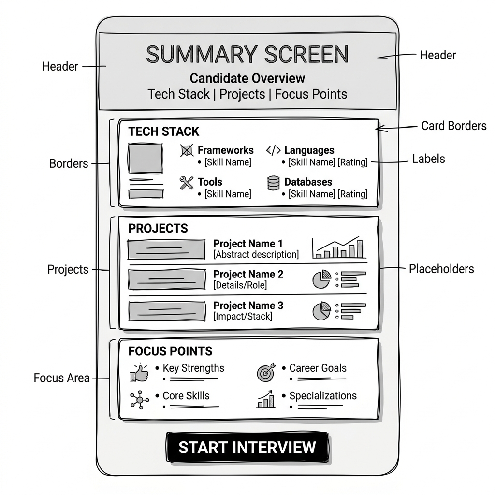
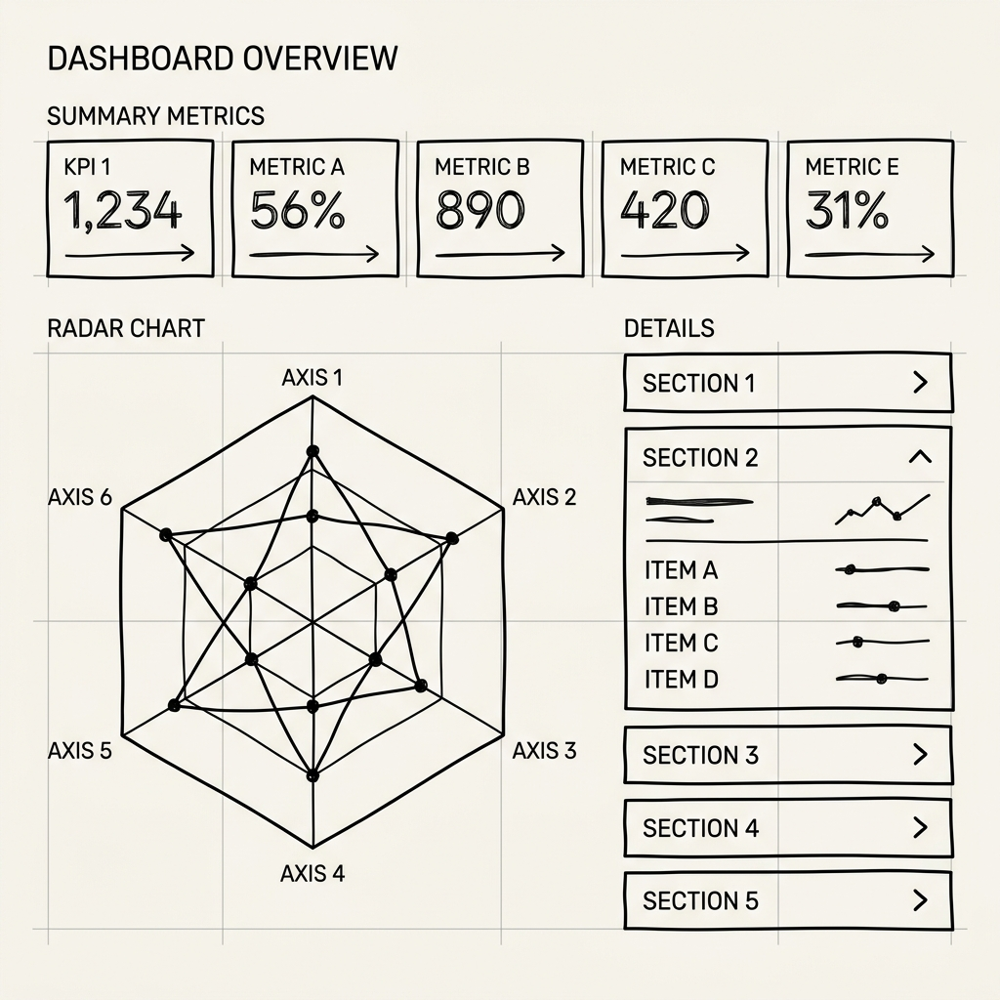

# 🎨 UI 스토리보드 및 유저 플로우 (User Flow)

본 문서는 사용자가 앱에 접속한 후 면접을 마치고 결과를 확인할 때까지의 4단계 화면 전환(Routing) 흐름을 정의합니다.

## 📱 Page 1: 홈 화면 (Home & Setup)
> 💡 **UI 와이어프레임:**
> 
* **목적:** 서비스 첫인상 및 이력서 업로드
* **UI 구성 (화면 중앙 집중형):**
  * **큰 타이틀:** "👔 Tech-Interviewer AI"
  * **서브 텍스트:** "당신의 이력서를 분석하여 실제 면접처럼 날카로운 꼬리 질문을 던집니다."
  * **파일 업로드 박스:** 화면 정중앙에 큼직하게 배치 (`이력서 PDF 업로드`)

  * **업로드 버튼:** "📄 이력서 분석하기"
* **인터랙션:** 버튼 클릭 시 즉시 Page 2로 라우팅되며, 백그라운드에서 파일 업로드 및 분석 요청이 진행됨.

## 📱 Page 2: 이력서 요약 확인 화면 (Resume Summary)
> 💡 **UI 와이어프레임:**
> 
* **목적:** AI가 파악한 내 이력서의 핵심 내용을 확인하고 마음의 준비를 하는 단계
* **UI 구성:**
  * **대기 상태 (Loading):** 분석이 진행되는 동안 화면 중앙에 로딩 스피너와 안내 문구 노출
  * **상단 헤더:** (분석 완료 후) "면접관이 이력서 분석을 완료했습니다!"
  * **요약 박스 (카드 UI):**
    * 🛠️ **파악된 주요 기술 스택:** (예: React, Node.js, AWS)
    * 🏆 **주목할 만한 프로젝트:** (예: 대용량 트래픽 처리 서버 구축)
    * ⚠️ **예상되는 집중 질문 포인트:** (예: 데이터베이스 인덱싱 및 캐싱 전략)
  * **하단 버튼:** "🚀 실전 면접 시작하기"
* **인터랙션:** 요약 내용을 확인하고 '시작' 버튼을 누르면 긴장감과 함께 Page 3으로 라우팅됨.

## 📱 Page 3: 면접 대화 화면 (The Interview)
* **목적:** 실제 기술 면접과 동일한 긴장감과 몰입감을 제공하는 실시간 채팅 인터페이스
* **UI 구성 (Split-Pane Layout 적용):**
  * **좌측 패널 (30% 비율 - 면접 대시보드):** 
    * **상단 진행률:** 프로그레스 바(Progress Bar)를 통해 전체 면접 진행도(예: 2/5 질문 완료)를 시각적으로 강조.
    * **면접 히스토리 로그:** 이전에 지나간 [질문 ➔ 내 답변 ➔ AI 평가] 세트가 실시간으로 누적됨. 정보의 과부하를 막기 위해 아코디언(MUI Accordion) 형태로 접어두어 깔끔하게 유지하되, 언제든 열어볼 수 있도록 배치.
  * **우측 패널 (70% 비율 - 메인 면접장):** 
    * **중앙 챗봇 뷰:** 카카오톡이나 슬랙처럼 대화에 몰입할 수 있는 뷰. 면접관의 질문은 좌측(Glassmorphism 바탕), 사용자의 답변은 우측(Cyan 포인트) 말풍선으로 배치.
    * **타이핑 인디케이터:** 사용자가 답변을 제출하면, AI가 평가하고 다음 꼬리 질문을 고민하는 동안 "면접관이 답변을 검토 중입니다..."라는 부드러운 애니메이션(Dot-pulse) 노출.
    * **하단 입력 폼:** 긴 코드나 상세한 설명도 작성하기 편한 다중 줄(Multi-line) 텍스트 입력창. 전송 버튼과 단축키(Cmd/Ctrl + Enter) 동시 지원.
* **인터랙션 (Micro-interactions):**
  * Page 3 진입과 동시에 면접관이 인사와 함께 첫 번째 질문을 부드럽게(Fade-in) 던지며 면접 시작.
  * 새로운 메시지가 추가될 때마다 최하단으로 자연스럽게 스크롤링(Smooth Scroll).
  * 약속된 횟수(예: 5회)의 질의응답이 끝나면, "면접이 종료되었습니다. 최종 리포트를 생성합니다..." 문구와 함께 딜레이 후 Page 4로 자동 라우팅.

## 📱 Page 4: 최종 결과 리포트 화면 (Result Dashboard)
> 💡 **UI 와이어프레임:**
> 
* **목적:** 면접 결과 분석 및 피드백 시각화
* **UI 구성:**
  * **화면 전환 효과:** 팡파르 애니메이션 (`st.balloons()`) 적용.
  * **상단 요약 (Metrics):** 종합 점수, 최고 강점 등을 숫자로 강조.
  * **중앙 차트:** 6대 역량(CS, 프레임워크, 논리력 등)을 육각형 레이더 차트로 시각화.
  * **하단 피드백 리스트:** 각 질문별로 [내 답변]과 [AI 모범 답안]을 아코디언(Expander) 형태로 비교.
  * **최하단 버튼:** "🔄 홈으로 돌아가기" (클릭 시 세션 초기화 후 Page 1로 이동)
