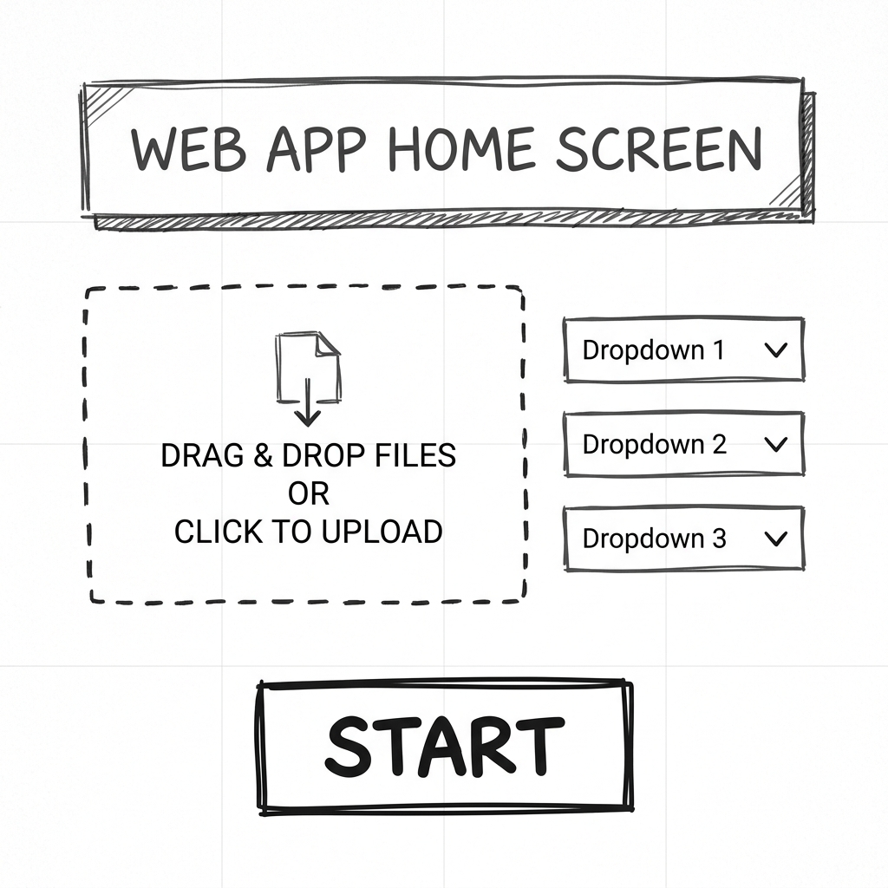
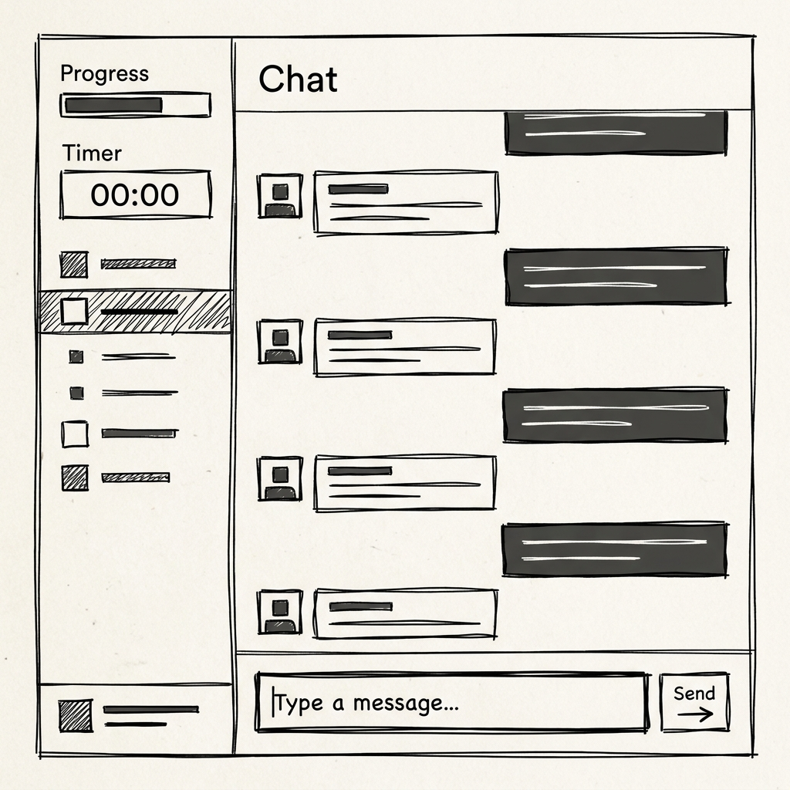

# 🎨 UI 스토리보드 및 유저 플로우 (User Flow)

본 문서는 사용자가 앱에 접속한 후 면접을 마치고 결과를 확인할 때까지의 4단계 화면 전환(Routing) 흐름을 정의합니다.

## 📱 Page 1: 홈 화면 (Home & Setup)
> 💡 **UI 와이어프레임:**
> 
* **목적:** 서비스 첫인상 및 이력서 업로드
* **UI 구성 (화면 중앙 집중형):**
  * **큰 타이틀:** "👔 Tech-Interviewer AI"
  * **서브 텍스트:** "당신의 이력서를 분석하여 실제 면접처럼 날카로운 꼬리 질문을 던집니다."
  * **파일 업로드 박스:** 화면 정중앙에 큼직하게 배치 (`이력서 PDF 업로드`)
  * **설정 폼:** 지원 직무 선택, 경력 연차 선택
  * **업로드 버튼:** "📄 이력서 분석하기"
* **인터랙션:** 버튼 클릭 시 이력서 파싱이 시작(로딩 스피너)되며, 완료 시 Page 2로 전환.

## 📱 Page 2: 이력서 요약 확인 화면 (Resume Summary)
> 💡 **UI 와이어프레임:**
> 
* **목적:** AI가 파악한 내 이력서의 핵심 내용을 확인하고 마음의 준비를 하는 단계
* **UI 구성:**
  * **상단 헤더:** "면접관이 이력서 분석을 완료했습니다!"
  * **요약 박스 (카드 UI):**
    * 🛠️ **파악된 주요 기술 스택:** (예: React, Node.js, AWS)
    * 🏆 **주목할 만한 프로젝트:** (예: 대용량 트래픽 처리 서버 구축)
    * ⚠️ **예상되는 집중 질문 포인트:** (예: 데이터베이스 인덱싱 및 캐싱 전략)
  * **하단 버튼:** "🚀 실전 면접 시작하기"
* **인터랙션:** 요약 내용을 확인하고 '시작' 버튼을 누르면 긴장감과 함께 Page 3으로 라우팅됨.

## 📱 Page 3: 면접 대화 화면 (The Interview)
> 💡 **UI 와이어프레임:**
> 
* **목적:** 본질에 집중할 수 있는 깔끔한 채팅 인터페이스
* **UI 구성:**
  * 이전 화면의 파일 업로더나 요약 정보 등은 모두 사라짐.
  * **사이드바 (보조 정보):** 현재 질문 진행도 (예: 2/5 진행 완료) 및 답변 타이머.
  * **중앙 메인 화면:** 오직 대화에만 집중할 수 있는 챗봇 UI (`st.chat_message`).
  * **하단 입력창:** 답변을 입력하는 텍스트 폼 (`st.chat_input`).
* **인터랙션:**
  * 사용자가 답변을 입력하면 AI가 평가 후 꼬리 질문 또는 다음 질문을 던짐.
  * 지정된 횟수의 질문이 끝나면 "면접이 종료되었습니다. 결과를 분석합니다..." 메시지가 뜨며 Page 4로 라우팅됨.

## 📱 Page 4: 최종 결과 리포트 화면 (Result Dashboard)
> 💡 **UI 와이어프레임:**
> 
* **목적:** 면접 결과 분석 및 피드백 시각화
* **UI 구성:**
  * **화면 전환 효과:** 팡파르 애니메이션 (`st.balloons()`) 적용.
  * **상단 요약 (Metrics):** 종합 점수, 최고 강점, 평균 답변 시간 등을 숫자로 강조.
  * **중앙 차트:** 6대 역량(CS, 프레임워크, 논리력 등)을 육각형 레이더 차트로 시각화.
  * **하단 피드백 리스트:** 각 질문별로 [내 답변]과 [AI 모범 답안]을 아코디언(Expander) 형태로 비교.
  * **최하단 버튼:** "🔄 홈으로 돌아가기" (클릭 시 세션 초기화 후 Page 1로 이동)
